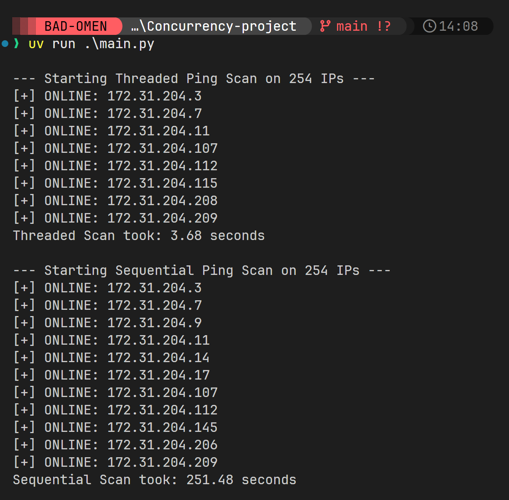
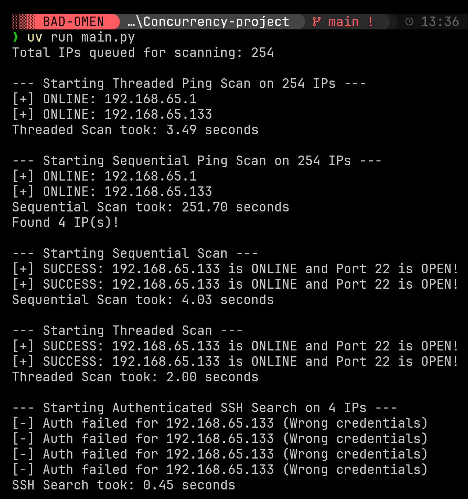

# Network Scanner Concurrency Lab

**Disclaimer:**
**งานนี้ทำและทดสอบใน Windows 11** Linux/MacOS อาจมี bug และโปรดตรวจสอบขอบเขต IP ในตัวแปร `networks_to_scan` ภายในช่วงไฟล์ `main.py` ให้ถูกต้อง การนำโปรแกรมนี้ไปสแกนรหัสผ่านหรือช่องโหว่เซิร์ฟเวอร์ในระบบเครือข่ายผู้อื่นโดยไม่ได้รับอนุญาตอาจถือเป็นความผิดตามกฎหมาย พัฒนาเครื่องมือนี้ไว้เพื่อศึกษาคอนเซปต์ของ Threading และ Network Development ในสภาพแวดล้อมแบบปิด (Lab) เท่านั้น

---

งานนี้พัฒนาขึ้นมาเพื่อศึกษาและทดลองการทำงานแบบ **Concurrency** ในภาษา Python (โดยประยุกต์ใช้ `ThreadPoolExecutor`) สำหรับสร้างเครื่องมือ **Network Scanner** เพื่อสแกนหาอุปกรณ์ เซอร์วิส และรหัสผ่าน SSH บนเครือข่าย

จุดประสงค์หลักคือการ **เปรียบเทียบประสิทธิภาพ** ระหว่างการเขียนโค้ดทำงานทางเครือข่ายแบบทางเดียว (Sequential) และแบบช่วยกันรันหลายพาร์ทพร้อมๆ กัน (Threaded)

---

## Features

1. **Ping Scan:** ค้นหาและคัดกรองหมายเลข IP ภายในเครือข่ายย่อย (Subnet) เพื่อดูว่าเครื่องใดเปิดใช้งานและตอบสนองอยู่ (Online IPs)
2. **Port Scan:** ตรวจสอบ IP ที่ออนไลน์เหล่านั้นว่ามีการเปิดพอร์ต TCP เบอร์ `22` (SSH) ทิ้งไว้หรือไม่
3. **SSH Login Check:** นำ IP ที่เปิดพอร์ต 22 มาทดสอบพยายามล็อกอินเซิร์ฟเวอร์ผ่าน SSH ด้วยชุดบัญชีและพาสเวิร์ดที่ตั้งไว้ (`user:1234`) เพื่อยืนยันว่าเข้าใช้งานเครื่องเป้าหมายได้จริงหรือไม่ พร้อมทั้งดึงชื่อ Hostname กลับมาแสดงผล

---

## How It Works

การสแกนเครือข่ายประกอบไปด้วยชุดคำสั่งที่อาศัยการเข้าถึงเครือข่ายระดับ OS:
- **`subprocess.run`**: เรียกใช้งานโปรแกรม `ping` ในตัวเครื่อง ส่งแพ็กเก็ต ICMP ออกไปเช็คสถานะ
- **`socket`**: สร้างอ็อบเจกต์ Socket ในการเชื่อมต่อไปยัง IP เครือข่ายเพื่อตรวจสอบการเชื่อมต่อพอร์ตแบบ TCP (`connect_ex`)
- **`paramiko`**: อาศัยไลบรารีนี้เป็น Client เพื่อจำลองการล็อกอิน Remote เข้าไปสั่งการ (`exec_command`) แบบ SSH

---

## เปรียบเทียบ Sequential vs. Threaded (Concurrency)

ความท้าทายของโปรแกรมแนวสแกนเครือข่ายคืองานจะหนักไปที่ช่วงเวลา **Network Latency / I/O-bound** ไม่ใช่ภาระการประมวลผลคำนวณ:

- **การทำงานแบบ Sequential:** โปรแกรมจะเช็ค IP ที่ 1 และรอจนกว่าเครือข่ายจะตอบรับ (หรือ Timeout) ก่อนค่อยเริ่มเช็ค IP ที่ 2... หากเครือข่ายมีเครื่องที่ไม่ตอบสนองเยอะ โปรแกรมจะใช้เวลาสะสมรวมกันหลายนาทีกว่าจะรันจนจบ
- **การทำงานแบบ Threaded:** โปรแกรมอาศัย `ThreadPoolExecutor(max_workers=100)` แบ่งเธรดออกไปเช็ค 100 หมายเลข IP ในเวลาเดียวกัน ทำให้ทุกเครื่องถูกเช็คและสามารถรอนับเวลา Timeout พร้อมๆ กันได้ ส่งผลให้ลดระยะเวลาสแกนทั้งเครือข่ายเหลือเพียงระยะเวลาหลักไม่กี่วินาที

**ภาพประกอบตัวอย่างจากการประมวลผล:**


*(เปรียบเทียบประสิทธิภาพของ Threads)*


*(ผลลัพธ์เจาะลึกการรันและล็อกอินผ่าน SSH พอร์ตต่างๆ และ Sequential vs Threaded)*

---

### 1. วิธีติดตั้ง `uv`

ทำตาม link นี้ [https://docs.astral.sh/uv/getting-started/installation/](https://docs.astral.sh/uv/getting-started/installation/)

### 2. วิธีสั่งรันโปรแกรม

```bash
git clone https://github.com/psu6810110042/Concurrency-Lab.git
```

```bash
cd Concurrency-Lab
```

```bash
uv run main.py
```

---
## Made by Jirakorn Sukmee(นายจิรกร สุขมี) 6810110042
Department of Computer Engineering, **Faculty of Engineering**,Prince of Songkla University
